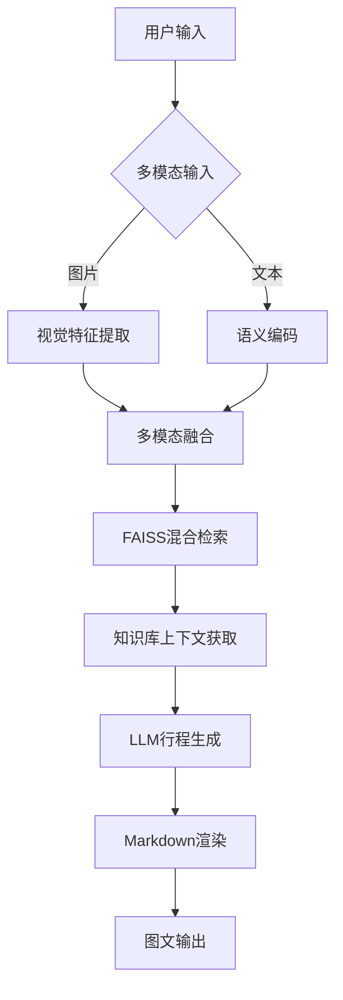
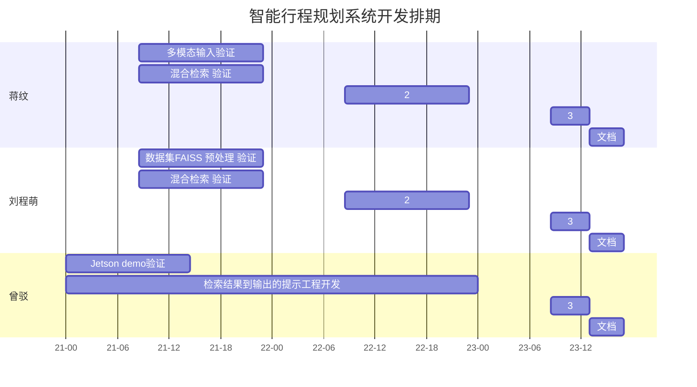

## 一、系统核心流程图


## 二、核心流程详解
### 阶段1：多模态输入处理

1. 输入捕获
- Gradio界面同时接收：

    - 图像输入：支持JPG/PNG格式（最大5MB）
    - 文本输入：200字以内自然语言描述
    - 示例输入组合：
```
inputs = {
    "image": "mountain.jpg", 
    "text": "计划3天徒步行程，偏好生态露营"
}
```
2. 并行编码
- 视觉通道：
```
# 使用NVIDIA NIM视觉服务
img_embed = nim.call_service(
    service="multimodal_encoder",
    params={"modality": "image"},
    inputs={"data": image_bytes}
)
```

- 文本通道：

```
    # 使用NVIDIA NIM文本服务
text_embed = nim.call_service(
    service="multimodal_encoder", 
    params={"modality": "text"},
    inputs={"data": input_text}
)
```
### 阶段2：联合检索
1. 特征融合

- 采用加权拼接策略：
```
fused_embed = np.concatenate([
    0.6 * img_embed,  # 视觉特征权重
    0.4 * text_embed  # 文本特征权重
])
```

- L2归一化处理保证检索稳定性
2. 混合检索

- FAISS索引配置：
```
index = faiss.IndexHNSWFlat(
    dimension=1024,  # 融合后维度
    M=32,            # HNSW层级参数
    metric=faiss.METRIC_INNER_PRODUCT
)
```

- 执行多模态检索：
```
D, I = index.search(fused_embed, k=3)  # 返回top3结果
```

###　阶段3：行程生成（关键路径耗时<3秒）
1. 上下文构建

- 动态提示工程：
```
prompt_template = """
[系统角色] 专业旅行规划师
[用户需求] {user_text}
[相关景点] {retrieved_pois}
[图片特征] {image_tags}

请生成包含以下要素的行程：
1. 每日时间轴（7:00-22:00） 
2. 交通衔接建议
3. 必体验项目（带emoji标注）
"""
```
- 结构化生成

  - 调用NIM对话服务：
```
response = nim.call_service(
    service="itinerary_llm",
    inputs={
        "prompt": constructed_prompt,
        "response_format": "markdown"
    },
    params={
        "temperature": 0.3,
        "max_tokens": 1500
    }
)
```

### 阶段4：结果渲染
1. 图文合成

- Markdown增强方案：
``` md
## 三日徒步行程
  
**Day1**  
✅ 07:00 山脚集合 → 🚌 乘坐接驳车  
🌳 09:00-12:00 雨林穿越（需携带：...）
```

2. 输出优化
```
自动生成缩略图：
def generate_thumbnail(img):
    return cv2.resize(img, (320, 240), 
        interpolation=cv2.INTER_AREA)
```


## 三、项目排期



## 四：测试对话

[AI] 请问您想要什么样的旅游呢？
[用户] 我想去阳光明媚的地方 + 图片
[AI] 推荐景点：
1. 三亚亚龙湾：碧海银沙，热带风情...
2. 厦门鼓浪屿：文艺小岛，百年建筑...
3. 大理洱海：苍山映湖，白族文化...
请选择（输入编号或名称）：
[用户] 大理洱海
[AI] 推荐路线：
1. 环湖骑行路线：专业自行车道...
2. 文化探访路线：白族民居体验...
3. 摄影打卡路线：最佳取景点...
请选择：
[用户] 路线2
[AI] 显示Markdown格式的详细攻略


