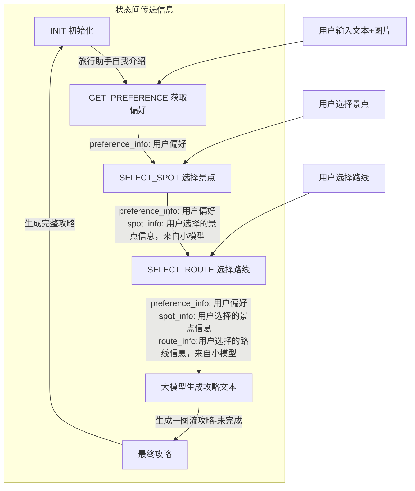

# CereBraWise - 智能旅游助手
## 第十一届Sky Hackathon 参赛项目书

### 项目概述
初衷：有时候，我们在网上看到一张漂亮的图片，就能够激发我们的旅游欲望……
CereBraWise是一个基于大语言模型的智能旅游助手，它能够通过多模态交互方式，为用户提供个性化的旅游规划服务。通过结合文本和图像输入，系统能够精准理解用户需求，并提供定制化的旅游建议。

### 作品亮点与特色
1. **多模态交互体验**
   - 支持文本+图片的混合输入方式
   - 用户可以通过上传景点图片或文字描述来表达旅行偏好
   - 系统能够智能识别图片中的景点(多模态+RAG)，结合用户文字描述进行个性化推荐

2. **状态管理**
   - 采用状态机设计模式，实现对话流程的精确控制
   - 支持多轮对话，保持上下文连贯性
   - 状态流转清晰，用户交互自然流畅
   - 使用大模型进行状态管理（DEBUG中:joy:）


3. **深度个性化推荐**
   - 基于用户偏好和图片特征进行景点匹配
   - 提供多样化的路线选择
   - 生成详细的旅游攻略，包含时间安排、必玩项目、餐饮推荐等

4. **生成一图流攻略**（未完成:joy:）

### AIGC工具应用
1. **NIM（NVIDIA AI Foundation Models）应用**
   - 使用图像大模型进行图像特征提取
   - 利用大语言模型进行自然语言理解和生成
   - 实现了以下生成内容：
     * 文本内容：景点描述、路线规划、旅游攻略
     * 向量内容：图片特征向量
     * 结构化数据：行程时间表、预算估算

2. **RAG技术应用**
   - 构建了基于FAISS的向量检索系统
   - 实现了图片到景点类别的智能匹配
   - 支持相似景点推荐功能

### 技术创新点
1. **多模型协同**
   - 大模型(80B)负责主要对话生成
   - 小模型(8B)+Pydantic负责选项解析
   - 向量模型负责图像特征提取
  
   
2. **状态链设计模式**（计划用小参数大模型来完成状态转移，但是没完成:joy:）
   ```python
   def build_state_chain() -> RunnableBranch:
       return RunnableBranch(
           (lambda s: s["step"] == TourismState.INIT, ...),
           (lambda s: s["step"] == TourismState.SELECT_SPOT, ...),
           (lambda s: s["step"] == TourismState.SELECT_ROUTE, ...),
           (True, ...)
       )
   ```
   - 实现了清晰的状态转换逻辑
   - 提高了代码可维护性

### UI优化设计
**完成Gradio界面**
   - 同时输入文本和图片
   - 聊天记录实时更新
   - 聊天对话框中能够显示图片
   - 编译展示markdown文本（未完成:joy:）
   - 展示一图流攻略（未完成:joy:）