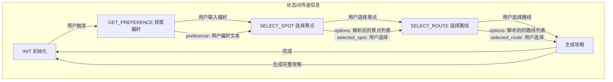

```mermaid
graph TD
    A[INIT 初始化] -->|用户触发| B[GET_PREFERENCE 获取偏好]
    B -->|用户输入偏好| C[SELECT_SPOT 选择景点]
    C -->|用户选择景点| D[SELECT_ROUTE 选择路线]
    D -->|用户选择路线| E[生成攻略]
    E -->|完成| A
    
    subgraph 状态间传递信息
    B -->|preference: 用户偏好文本| C
    C -->|options: 解析后的景点列表<br>selected_spot: 用户选择| D
    D -->|options: 解析后的路线列表<br>selected_route: 用户选择| E
    E -->|生成完整攻略| A
    end
```