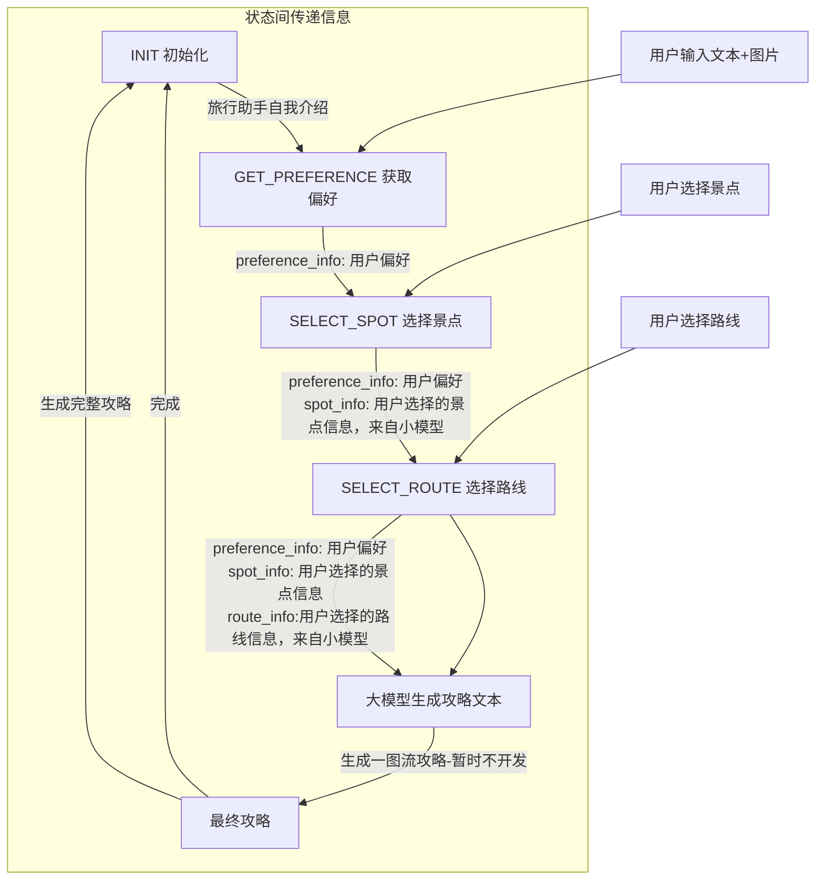

```mermaid
graph TD
    A[INIT 初始化] -->|旅行助手自我介绍| B[GET_PREFERENCE 获取偏好]

    B0[用户输入文本+图片] --> B
    C0[用户选择景点] --> C[SELECT_SPOT 选择景点]
    D0[用户选择路线] --> D[SELECT_ROUTE 选择路线]

    D --> E[大模型生成攻略文本]
    F -->|完成| A
    
    subgraph 状态间传递信息
    B -->|preference_info: 用户偏好| C
    C -->|preference_info: 用户偏好
    spot_info: 用户选择的景点信息，来自小模型| D
    D -->|preference_info: 用户偏好
    spot_info: 用户选择的景点信息
    route_info:用户选择的路线信息，来自小模型| E
    E -->|生成一图流攻略-暂时不开发| F[最终攻略]
    F -->|生成完整攻略| A
    end
```